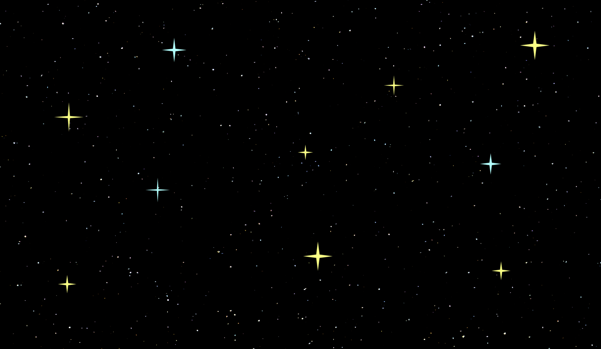

# Catch the Falling Stars

## Description
A fun and challenging game where you catch falling stars while avoiding debris. Collect stars to increase your score and hearts to gain extra lives. The game gets progressively harder as you play!

## Installation
1. Clone the repository:
```
git clone https://github.com/yourusername/catch-the-falling-stars.git
```
2. Open the `index.html` file in your browser.

## How to Play
- Use mouse or arrow keys to move the basket
- Catch falling stars to increase your score
- Avoid debris that reduces your score
- Collect hearts to gain extra lives
- Game ends when you lose all lives

## Features
- Progressive difficulty
- Multiple star types with different point values
- High score tracking
- Responsive controls (mouse and keyboard)

## Screenshots


## Credits
- Background music: [Background Music](https://example.com)
- Sound effects: [Sound Effects](https://example.com)
- Game assets: [Game Assets](https://example.com)